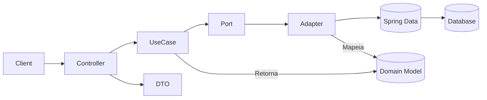

<!--
====================================================================================
DOCUMENTAÇÃO CLEAN ARCHITECTURE v2
Criação: 24/08/2025 | Última Modificação: 03/09/2025 | Versão Doc: 1.1
Histórico:
 - 1.0 (24/08/2025): Documento inicial focado em Order.
 - 1.1 (03/09/2025): Expansão para User / Email, inclusão de tabelas de métodos, complexidade, parâmetros, validações e comparativos v1 vs v2.
====================================================================================
-->

# Documentação Fluxo Clean Architecture (Order, User, Email)

> Propósito: Documentar de forma operacional e auditável o fluxo de requisições, regras de negócio, validações, anotações Spring relevantes e padrões de Clean Architecture aplicados na migração da v1 (service-centric) para a v2 (use cases + ports & adapters + value objects).

## 1. Introdução
O módulo v2 estabelece um núcleo de domínio independente de frameworks. A lógica de negócios migra de classes anotadas com `@Service` (v1) para casos de uso (Application Rules) simples e testáveis. Adapters encapsulam infraestrutura (JPA, HTTP, envio de email). Value Objects reforçam invariantes (ex: `Email`, `FullName`, `Password`) reduzindo regras dispersas.

Categoria principal: Gestão de Pedidos `(Order)`, Gestão de Usuários `(User)`, Envio de Email `(EmailBudget)` – domínios transacionais de negócio.

**Desacoplamentos e inversões:**
- Controladores dependem de casos de uso, não de repositories concretos.
- Casos de uso dependem de interfaces (ports/gateways) – DIP aplicado.
- Classes de domínio puras (sem JPA / Lombok).
- Adapter de persistência converte Domain ↔ Entity para isolar anotações `@Entity`, `@Column`, etc.

Remoção (v1 → v2) de anotações diretas em regras de negócio: `@Service`, `@Component` (em classes de lógica), injeção direta de `EntityManager` ou `JpaRepository` dentro da lógica. Agora a composição está centralizada em `@Configuration`.

### 1.1 Mapeamento de Camadas
| Camada | Objetivo | Diretório | Exemplos |
|--------|----------|----------|----------|
| Domain | Modelo + Invariantes | `core/domain/model` | `Order`, `User`, `Role`, `EmailBudget`, VOs (`Email`, `FullName`, `Password`) |
| Domain Ports | Contratos de saída | `core/domain/repository` | `OrderRepositoryGateway`, `UserGateway`, `RoleGateway`, `EmailGateway` |
| Use Cases | Orquestra regras + portas | `core/usecase/**` | `CreateOrderUseCase`, `SendEmailUseCase`, `CreateUserUseCase` |
| Infrastructure – Persistence | Implementa ports | `infrastructure/persistence` | `OrderRepositoryAdapter`, `OrderEntity` |
| Infrastructure – Web | Exposição REST | `infrastructure/web` | `OrderController`, `OrderRest`, `OrderRestMapper` |
| Configuration | Composition root | `infrastructure/config` | `OrderUseCaseConfig` |

> Regra de dependência: somente fluxos OUT → IN. Nada no domínio conhece Spring / JPA.

### 1.2 Diagrama Macro (Mermaid)


## 2. Funcionalidades (Métodos & Complexidade)

Critérios de complexidade: *(Muito Alta / Alta / Média / Baixa)*.

### 2.1 Order (Fluxo CRUD)
| Método | Camada | Tipo | Complexidade | Responsabilidade |
|--------|--------|------|--------------|------------------|
| `CreateOrderUseCase.execute(Order)` | Use Case | Público | Baixa | Persistir novo pedido |
| `UpdateOrderUseCase.execute(Long, Order)` | Use Case | Público | Média | Atualizar campos mutáveis |
| `GetOrderByIdUseCase.execute(Long)` | Use Case | Público | Baixa | Consulta by id |
| `ListOrdersUseCase.execute()` | Use Case | Público | Baixa | Listagem total |
| `DeleteOrderUseCase.execute(Long)` | Use Case | Público | Baixa | Remoção por id |
| `OrderRepositoryAdapter.save(Order)` | Adapter | Público | Baixa | Persistir via Spring Data |
| `OrderRepositoryAdapter.findById(Long)` | Adapter | Público | Baixa | Buscar |
| `OrderRepositoryAdapter.findAll()` | Adapter | Público | Baixa | Listar |
| `OrderRepositoryAdapter.deleteById(Long)` | Adapter | Público | Baixa | Delegar exclusão |
| `OrderRepositoryAdapter.existsById(Long)` | Adapter | Público | Baixa | Verificar existência |
| `OrderRepositoryAdapter.toEntity(Order)` | Adapter | Privado | Baixa | Map Domain→Entity |
| `OrderRepositoryAdapter.toDomain(OrderEntity)` | Adapter | Privado | Baixa | Map Entity→Domain |

### 2.2 User / Role / Email
| Método | Camada | Tipo | Complexidade | Responsabilidade |
|--------|--------|------|--------------|------------------|
| `CreateUserUseCase.execute(CreateUserCommand)` | Use Case | Público | Média | Criar usuário |
| `UpdateUserUseCase.execute(Integer, CreateUserCommand)` | Use Case | Público | Média | Atualizar usuário |
| `DeleteUserUseCase.execute(Integer)` | Use Case | Público | Baixa | Remover usuário |
| `GetUserByIdUseCase.execute(Integer)` | Use Case | Público | Baixa | Buscar usuário |
| `ListUserUseCase.execute()` | Use Case | Público | Baixa | Listar usuários |
| `SendEmailUseCase.execute(EmailBudget)` | Use Case | Público | Baixa | Enviar email |
| `User.create(...)` | Domain Factory | Público | Baixa | Construção agregada |
| `Role.create(Long, String)` | Domain Factory | Público | Baixa | Validar role id |
| `Email.create(String)` | VO Factory | Público | Baixa | Validar email |
| `FullName.create(String)` | VO Factory | Público | Baixa | Validar nome |
| `Password.create(String)` | VO Factory | Público | Média | Validar força |

### 2.3 Anotações Spring & Lombok Relevantes
- `@RestController`, `@RequestMapping`, `@GetMapping`, `@PostMapping`, `@PutMapping`, `@DeleteMapping`: Infra → Web
- `@Configuration` + `@Bean`: Composition root dos casos de uso
- `@Service`: Adapter do gateway (`Order`, `User`, `Role`, `Email`)
- `@Entity`, `@Table`, `@Column`, `@Enumerated`, `@Id`, `@GeneratedValue`: Mapeamento JPA
- `@Data`, `@AllArgsConstructor`, `@NoArgsConstructor`: Redução de boilerplate em DTO / Entity (não em domínio puro)
- `@Tag`, `@Operation`, `@ApiResponse`: Documentação Swagger OpenAPI

## 3. Casos de Uso (Cenários de Negócio)
### 3.1 Order
| Caso | Cenário | Pré-condições | Pós-condições | Exceções (Atual / Planejada) |
|------|---------|---------------|---------------|-----------------------------|
| Criar Pedido | Registrar novo pedido | Campos obrigatórios preenchidos | Pedido persistido com `createdAt` | (Nenhuma) / `OrderValidationException` |
| Buscar Pedido | Obter pedido por id | ID existente | Pedido retornado | `NoSuchElementException` / `OrderNotFoundException` |
| Listar Pedidos | Listar todos os pedidos | - | Lista retornada | - / - |
| Atualizar Pedido | Editar campos mutáveis | Pedido existe | Campos atualizados + `updatedAt` | `NoSuchElementException` / `OrderNotFoundException` |
| Remover Pedido | Excluir por id | Pedido existe | Registro removido | `NoSuchElementException` / `OrderNotFoundException` |

### 3.2 User
| Caso | Cenário | Pré-condições | Pós-condições | Exceções (Atual / Planejada) |
|------|---------|---------------|---------------|-----------------------------|
| Criar Usuário | Registrar novo usuário interno | Email único, Role existente | Usuário ativo criado (`status=true`) | `RuntimeException` / `UserAlreadyExistsException`, `RoleNotFoundException` |
| Buscar Usuário | Obter usuário por id | ID válido existente | Usuário retornado | `RuntimeException` / `UserNotFoundException` |
| Listar Usuários | Listar todos os usuários | - | Lista retornada | - / - |
| Atualizar Usuário | Alterar dados cadastrais | Usuário existe, Role válida | Dados atualizados (BUG: redefine createdAt) | `RuntimeException` / `UserNotFoundException`, `RoleNotFoundException` |
| Remover Usuário | Inativar/remover usuário | Usuário existe | Registro removido | `RuntimeException` / `UserNotFoundException` |

### 3.3 Email
| Caso | Cenário | Pré-condições | Pós-condições | Exceções (Atual / Planejada) |
|------|---------|---------------|---------------|-----------------------------|
| Enviar Email | Notificação orçamentária | Gateway operacional, payload válido | Retorno mensagem sucesso | `IllegalStateException` / `EmailSendFailureException` |

> Observações:
> - Coluna "Planejada" indica exceptions específicas recomendadas para próxima etapa.
> - Criar `GlobalExceptionHandler` (REST) para mapear exceptions → códigos HTTP.
> - Adicionar validações estruturadas (Bean Validation) aos DTOs de entrada futuros.

### 3.4 Value Objects & Regras Implícitas
| Factory | Regras | Exceções (Atual / Planejada) |
|---------|--------|------------------------------|
| `Email.create` | Not blank, length ≤ 100, regex simples | `IllegalArgumentException` / `InvalidEmailException` |
| `FullName.create` | Not blank, length ≤ 100, somente letras/espaços | `IllegalArgumentException` / `InvalidFullNameException` |
| `Password.create` | 8–100 chars, maiúscula, minúscula, dígito, especial | `IllegalArgumentException` / `WeakPasswordException` |
| `Role.create` | id != null e > 1 | `IllegalArgumentException` / `InvalidRoleIdException` |

## 4. Exemplos de Código
### 4.1 Sequência (GET /v2/orders/{id})
```text
Client → OrderController.getById → GetOrderByIdUseCase.execute → OrderRepositoryGateway.findById
  ↳ (Adapter) repository.findById → JPA → DB → Entity → Domain
Retorno Domain → Mapper → DTO → HTTP 200
```

### 4.2 POST /v2/orders (Request/Response)
```json
{
  "codigo": "ORD-2025-0007",
  "nomeComprador": "Joao Silva",
  "emailComprador": "joao.silva@example.com",
  "cnpj": "12.345.678/0001-99",
  "valor": "1500.00",
  "status": "PENDENTE",
  "telCelular": "+55 11 98877-6655"
}
```

### 4.3 Criação de Usuário (Use Case)
```java
var cmd = new CreateUserCommand("Joao Silva", "joao@acme.com", "Str0ng!Pass", 2L);
User created = createUserUseCase.execute(cmd);
```

### 4.4 Envio de Email
```java
EmailBudget budget = new EmailBudget("user@acme.com", "User", "Assunto", "Conteúdo");
String status = sendEmailUseCase.execute(budget); // "Email enviado com sucesso!"
```

## 5. Diagramas de Sequência (Texto)
```text
[CreateUser]
Controller → CreateUserUseCase → UserGateway.existsByEmail → RoleGateway.getById → User.create(VOs) → UserGateway.save → Controller

[SendEmail]
Controller → SendEmailUseCase → EmailGateway.sendEmail (boolean) → (Falha?) lança IllegalStateException → Sucesso retorna mensagem
```

## 6. Comparativo v1 x v2 (Resumo)
| Aspecto | v1 | v2 |
|---------|----|----|
| Lógica de negócio | Services anotados | Use Cases puros | 
| Dependência de Framework | Alta (anotações em todo lugar) | Restrita a bordas (web, persistence) |
| Testabilidade | Necessita contexto parcial | Mock de ports, instância direta |
| Domínio | Anêmico / acoplado | Rico com VOs (User) |
| Tratamento de erros | Genérico | Em evolução (planejar exceptions dedicadas) |

## 7. Resumo Essencial
- Clean Architecture aplicada: núcleo independente.
- Value Objects adicionam robustez ao agregado `User`.
- Mapeamentos explícitos evitam vazamento de infra.
- Casos de uso enxutos facilitam manutenção.
- Próximos passos: foco em conversão completa de v1 para v2 (exceptions, segurança, validações avançadas, VOs).

---
